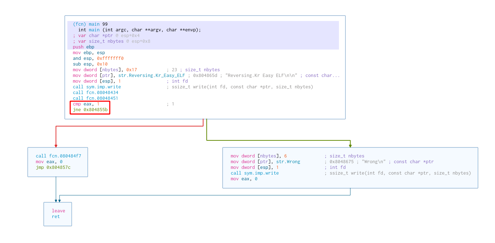
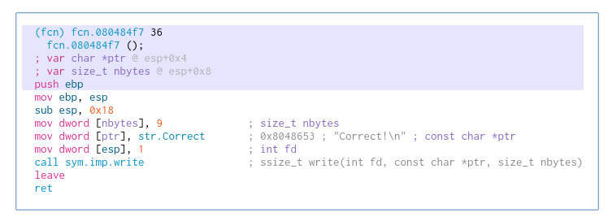
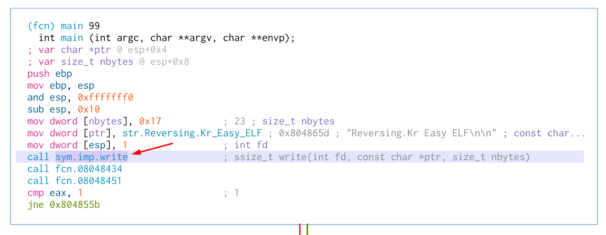
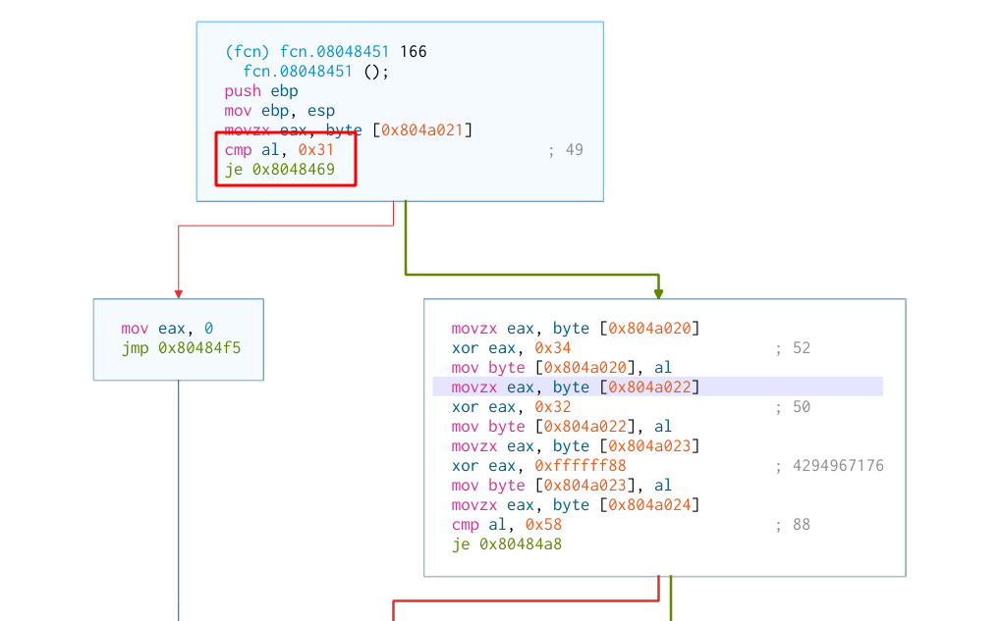
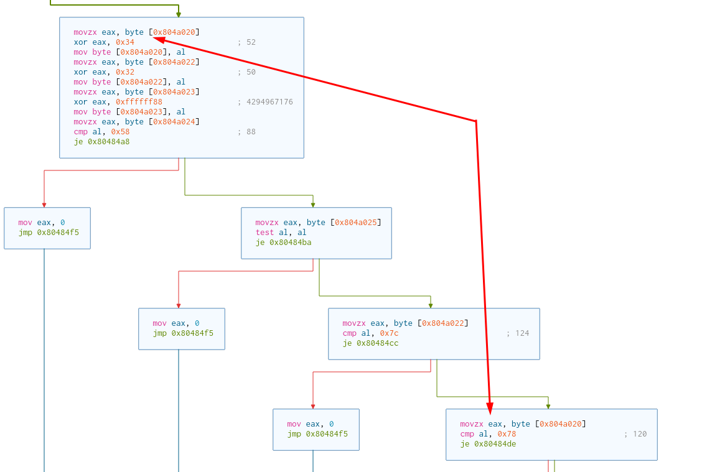

# Hồi bẩy: Easy ELF 

## Bước 0: Chạy thử 

```
minhkma at ₷ƙƴ♪♪♪ in ~/Desktop
  ﹏✍   ./Easy_ELF 
Reversing.Kr Easy ELF

minhkma
Wrong
```

## Bước 1: Hàm main 



`cmp eax, 1`

So sánh gía trị thanh ghi eax với 1. 

`jne 0x804855b`

Lệnh nhảy nếu eax không bằng 1.

=> Kết luận: Như vậy nếu giá trị eax nhỏ hơn 1 thì chương trình sẽ nhảy đến hàm mà mũi tên màu xanh chỉ. `Wrong` được hiện lên màn hình. Ngược lại nếu bằng 1 sẽ đi theo mũi tên màu đỏ đến hàm dưới:



Hiện `Correct` trên màn hình. Mục tiêu của mình là làm thế nào để  `Correct`. 

# Bước 2: 

Quay lại về hàm main. Ở hàm main thực hiện gọi tới 3 hàm.



- Hàm `call sym.imp.write` có thể dễ nhìn ra đó là để print lên màn hình `Reversing.Kr Easy ELF`. 

- Hàm `call fcn.08048434` không có gì đặc biệt. 

- Hàm `call fcn.08048451` 

    

    
    ```
    cmp al, 0x31
    je 0x8048469
    ```

    + So sánh giá trị thanh ghi al và 0x31. Lệnh je nhảy nếu hai giá trị bằng nhau.
    + Theo như các bạn quan sát nếu điều kiện nhảy được xảy ra (đi theo đừng màu xanh). Ở đây các bạn để ý xuống cuối thanh ghi eax sẽ được gán giá trị bằng 1. 

        

        + Nếu bằng 1 thì sẽ đi theo đường màu đỏ như lúc đầu ta phân tích.

    

    + Như vậy giá trị `0x804a021` là `0x31`

    

    + Trên ảnh trên ta thấy giá trị của `0x804a020` xor `0x34` = `0x78` 
    + Tương tự giá trị `0x804a022` xor `0x32` = `0x7c`
    + `0x804a023` xor `0xffffff88` = `0xdd`
    + `0x804a024` = `0x58`

- Sử dụng python 

    ```
    a = []
    a.append(chr(0x78 ^ 0x34))
    a.append(chr(0x31))
    a.append(chr(0x7c ^ 0x32))
    a.append(chr(0xdd ^ 0x88))
    a.append(chr(0x58))
    ```

    output

    ```
    In [10]: a = []
        ...: a.append(chr(0x78 ^ 0x34))
        ...: a.append(chr(0x31))
        ...: a.append(chr(0x7c ^ 0x32))
        ...: a.append(chr(0xdd ^ 0x88))
        ...: a.append(chr(0x58))

    In [11]: a
    Out[11]: ['L', '1', 'N', 'U', 'X']
    ```

- Flag `L1NUX`

    ```
    minhkma at ₷ƙƴ♪♪♪ in ~/Desktop
    ﹏✍   ./Easy_ELF 
    Reversing.Kr Easy ELF

    L1NUX
    Correct!
    ```
